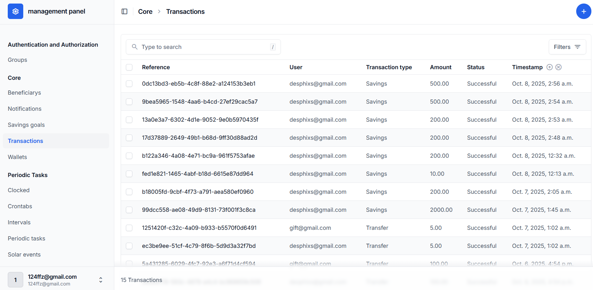
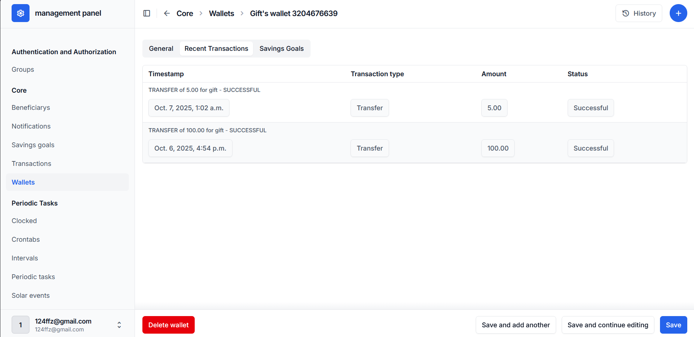
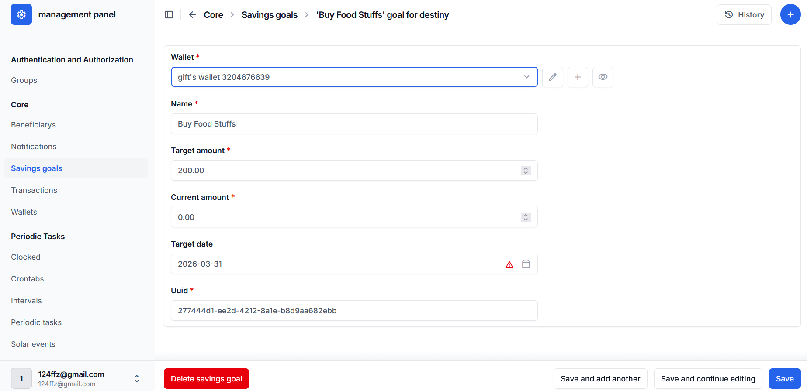
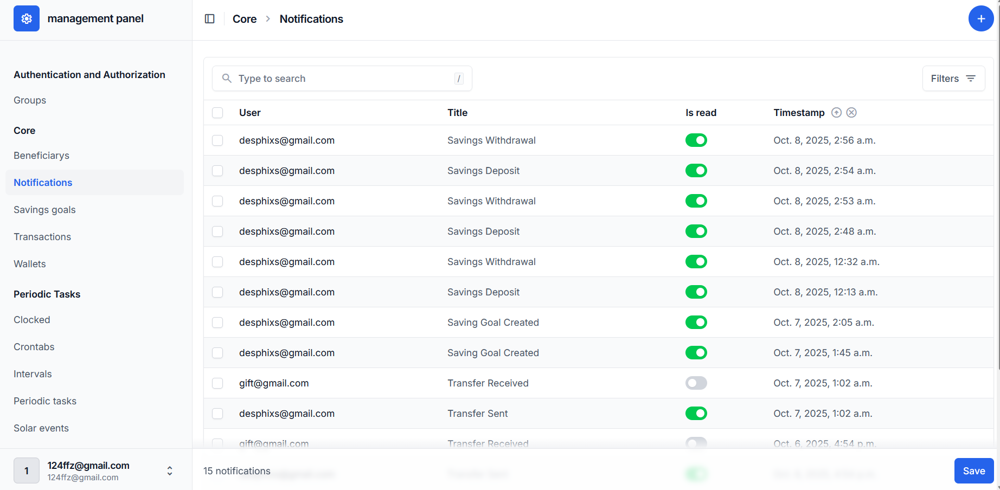

# 💳 FinTrack — Personal Finance & Wallet API

A production-ready backend for managing wallets, transfers, savings goals, and transaction history. Built with Django REST Framework, Redis, and Celery — containerized with Docker and deployed behind Traefik with CDN-based SSL.

> **Live API:** [https://portfolioproject.ir/api/](https://portfolioproject.ir/api/)
> **API Docs:** [https://portfolioproject.ir/api/docs/](https://portfolioproject.ir/api/docs/)
> **Infrastructure Dashboard:** [https://traefik.portfolioproject.ir](https://traefik.portfolioproject.ir) *(credentials in demo section below)*

---

## 📸 Screenshots

### Admin Panel — Transactions


### Admin Panel — Wallet Management


### Admin Panel — Savings Goals


### Admin Panel — Notifications


---

## 🏗️ Architecture

```
User
 │
 ▼
Cloudflare (SSL / CDN / DDoS protection)
 │
 ▼  HTTP
Traefik (reverse proxy + service discovery)
 ├── portfolioproject.ir/api/      → Django (Gunicorn, 3 workers)
 ├── portfolioproject.ir/admin/    → Django Admin
 └── traefik.portfolioproject.ir   → Traefik Dashboard
          │
          ├── internal network ──────────────────────────────
          │       PostgreSQL 15       (persistent volume)
          │       Redis 7             (cache + Celery broker)
          │       Celery Worker       (async tasks)
          │       Celery Beat         (scheduled tasks)
          └───────────────────────────────────────────────────
```

### Two Docker networks
| Network | Services | Purpose |
|---------|----------|---------|
| `proxy` | Traefik, Django | Public-facing routing |
| `internal` | PostgreSQL, Redis, Celery | Backend only, never reachable from outside |

---

## ✨ Features

### Wallet & Payments
- Wallet funding via aghayepardakht payment gateway
- Peer-to-peer transfers with PIN verification and KYC check
- Atomic transactions using `select_for_update()` to prevent race conditions
- Full transaction history

### Savings Goals
- Create goals with target amount and target date
- Deposit/withdraw funds between wallet and goals
- Progress tracking with percentage calculation

### Security
- KYC verification required before any transfer
- Transaction PIN on all outgoing transfers
- Beneficiary management with whitelist support

### Async Processing (Celery + Redis)
- All notifications created asynchronously — HTTP responses never wait for DB writes
- Deposit and transfer confirmation emails sent in background
- Daily wallet summary digest via Celery Beat (runs every day at 08:00)
- Retry logic with exponential backoff on task failure

### Caching (Redis)
| Endpoint | Cache TTL | Invalidation trigger |
|----------|-----------|----------------------|
| `GET /api/overview/` | 2 minutes | Any wallet/goal change |
| `GET /api/savings/` | 5 minutes | Goal create/deposit/withdraw |
| `GET /api/beneficiaries/` | 10 minutes | Beneficiary add/delete |

---

## 🛠️ Tech Stack

| Layer | Technology |
|-------|------------|
| Backend | Python 3.11, Django 4.x, Django REST Framework |
| Async tasks | Celery 5, Celery Beat |
| Cache & broker | Redis 7 |
| Database | PostgreSQL 15 |
| Reverse proxy | Traefik v3 |
| SSL / CDN | Cloudflare |
| Containerization | Docker, Docker Compose |
| Payments | aghayepardakht |
| Static files | Whitenoise |

---

## 🚀 Running Locally

### Prerequisites
- Docker and Docker Compose installed

### 1. Clone the repo
```bash
git clone https://github.com/zohre-sharafi-0121/finance-project.git
cd finance-project/backend
```

### 2. Set up environment variables
```bash
cp .env.example .env
# Open .env and fill in your values
```

### 3. Start everything
```bash
docker compose up -d --build
```

### 4. Create a superuser
```bash
docker compose exec api python manage.py createsuperuser
```

### 5. Visit
| URL | What |
|-----|------|
| http://localhost/api/ | REST API |
| http://localhost/admin/ | Django admin |
| http://localhost:8080 | Traefik dashboard (local) |

---

## 📁 Project Structure

```
backend/
├── backend/                    # Django project config
│   ├── settings.py             # Settings (Redis, Celery, database config)
│   ├── celery.py               # Celery app + Beat schedule
│   ├── urls.py
│   └── wsgi.py
│
├── core/                       # Main application — wallet, payments, savings
│   ├── models.py               # Wallet, Transaction, SavingsGoal, Notification, Beneficiary
│   ├── views.py                # All API views with Redis caching
│   ├── tasks.py                # Celery async tasks (notifications, emails)
│   ├── cache_utils.py          # Redis cache helpers (get/set/invalidate)
│   ├── serializers.py
│   └── urls.py
│
├── userauths/                  # Authentication & KYC
│   ├── models.py               # Custom User, KYC
│   ├── serializers.py
│   ├── views.py                # Register, login, token endpoints
│   └── urls.py
│
├── celery_app/                 # Celery Django app (registered in INSTALLED_APPS)
│   ├── models.py               # Celery Beat task schedule models
│   └── apps.py
│
├── screenshots/                # Admin panel screenshots (for README)
├── static/                     # Collected static files (whitenoise)
├── Dockerfile
├── docker-compose.yml
└── requirements.txt
```

---

## 🔌 API Endpoints

### Auth
| Method | Endpoint | Description |
|--------|----------|-------------|
| POST | `/api/auth/register/` | Register new user |
| POST | `/api/auth/login/` | Login, returns JWT |
| POST | `/api/auth/token/refresh/` | Refresh JWT |

### Wallet
| Method | Endpoint | Description |
|--------|----------|-------------|
| GET | `/api/overview/` | Dashboard summary *(cached)* |
| POST | `/api/verify/` | Fund wallet via payment gateway |
| POST | `/api/transfer/` | Transfer to another wallet |
| GET | `/api/wallet/<id>/` | Lookup wallet by ID |

### Savings Goals
| Method | Endpoint | Description |
|--------|----------|-------------|
| GET | `/api/savings/` | List all goals *(cached)* |
| POST | `/api/savings/create/` | Create a new goal |
| GET | `/api/savings/<uuid>/` | Goal detail + transaction history |
| POST | `/api/savings/deposit/` | Move funds from wallet to goal |
| POST | `/api/savings/withdraw/` | Withdraw completed goal to wallet |

### Beneficiaries
| Method | Endpoint | Description |
|--------|----------|-------------|
| GET | `/api/beneficiaries/` | List saved beneficiaries *(cached)* |
| POST | `/api/beneficiaries/create/` | Add a beneficiary |
| DELETE | `/api/beneficiaries/<id>/` | Remove a beneficiary |

### Notifications
| Method | Endpoint | Description |
|--------|----------|-------------|
| GET | `/api/notifications/` | List unread notifications |
| POST | `/api/notifications/<id>/read/` | Mark one as read |
| POST | `/api/notifications/read-all/` | Mark all as read |

---

## ⚙️ Key Engineering Decisions

**Atomic transfers with `select_for_update()`**
Both wallets are locked inside a single `transaction.atomic()` block before any balance change. This prevents double-spending if two transfers happen simultaneously.

**Notifications outside the atomic block**
Celery tasks are dispatched *after* `transaction.atomic()` commits. If they were inside the block, a task could read an uncommitted DB state and create a notification for a transfer that later rolled back.

**Cache invalidation strategy**
Rather than per-field invalidation, the entire user cache namespace is dropped on any mutation. Simple, correct, and fast enough for this scale.

**Two Docker networks**
PostgreSQL and Redis are on the `internal` network only. Even if Traefik were misconfigured, the database is unreachable from outside.

---

## 🔐 Demo Access

| Resource | URL | Credentials |
|----------|-----|-------------|
| Django Admin | https://portfolioproject.ir/admin/ | admin / ask-me |
| Traefik Dashboard | https://traefik.portfolioproject.ir | admin / ask-me |

---

## 📄 License

MIT